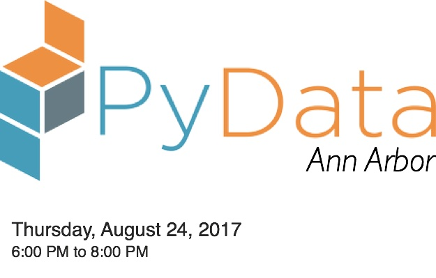
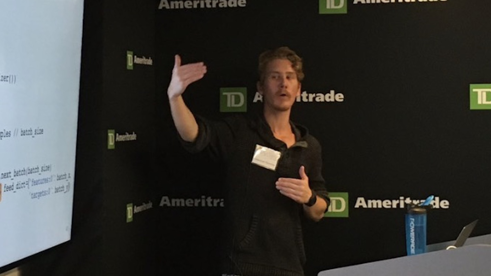

# Introduction to Deep Learning with TensorFlow

Sebastian Raschka, 2017

Code snippets for "Introduction to Deep Learning with TensorFlow" at PyData Ann Arbor Aug 2017

Slides: https://speakerdeck.com/rasbt/introduction-to-deep-learning-with-tensorflow-at-pydata-ann-arbor

- [Link to the recording](https://www.youtube.com/watch?v=vRF7ENlwD50&feature=youtu.be)

